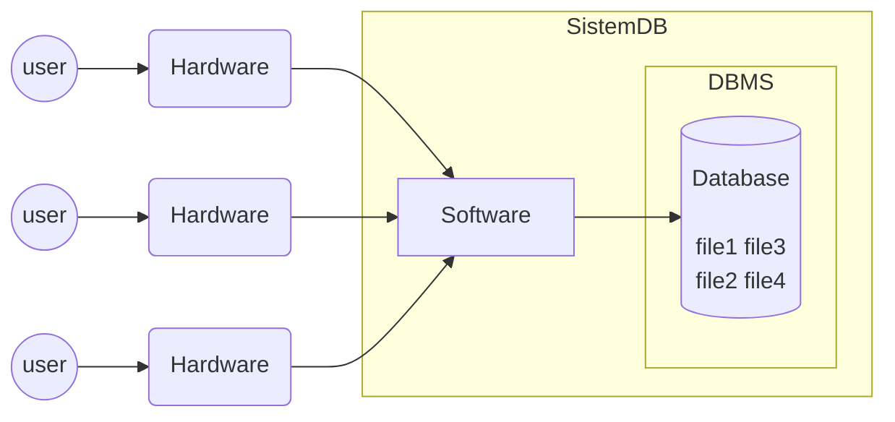

Tags : #Quiz #Database
### Soal :
1. Jelaskan Menurut Anda Apa Yang Dimaksud Dengan Basis Data?
2. Apakah Semua Data Yang Disimpan Dalam Media Penyimpanan Merupakan  Basis Data? Jelaskan
3. Mengapa Basis Data Diperlukan Penggerak?
4. Gambar Dan Jelaskan Komponen Dalam Basis Data !
5. Sebut Dan Jelaskan Macam-Macam User

### Jawaban :
1. Basis Data adalah kumpulan data / file yang saling berhubungan satu sama lain yang disimpan secara terorganisir dan tidak berulang sehingga dapat diakses secara cepat dan mudah.
2. Tidak, Dikarenakan yang dimaksud dengan basis data adalah data yang terorganisir / terkelompokan.
3. Dikarenakan Basis data hanyalah sebuah objek yang pasif / mati. karena itulah Basis data membutuhkan penggerak.
4. 

Penjelasan :

-  User     : Pengguna basis data
-  Hardware : Perangkat Keras yang digunakan user untuk menggunakan Aplikasi
-  Software / Aplikasi : Perangkat Lunak yang digunakan user untuk mengakses database
-  DBMS     : Perangkat Lunak yang digunakan aplikasi untuk mengakses dan menyimpan data di database
-  Basisdata: Tempat penyimpanan data
5. Berdasarkan cara berinterakasi pada basis data :
- Programmer Aplikasi : User yang berinteraksi dengan database melalui DML yang disertakan pada bahasa pemograman seperti PHP, Cobol, Pascal, DLL
- User Mahir : User yang berinteraksi dengan sistem tanpa menulis modul program dan menggunakan query untuk mengakses data
- User Khusus : User yang menulis aplikasi database non konvensional untuk keperluan Khusus.
- User Umum : User yang berinteraksi dengan sistem database melalu Pemanggilan Satu program aplikasi permanen yang ditulis atau disediakan sebelumnya

